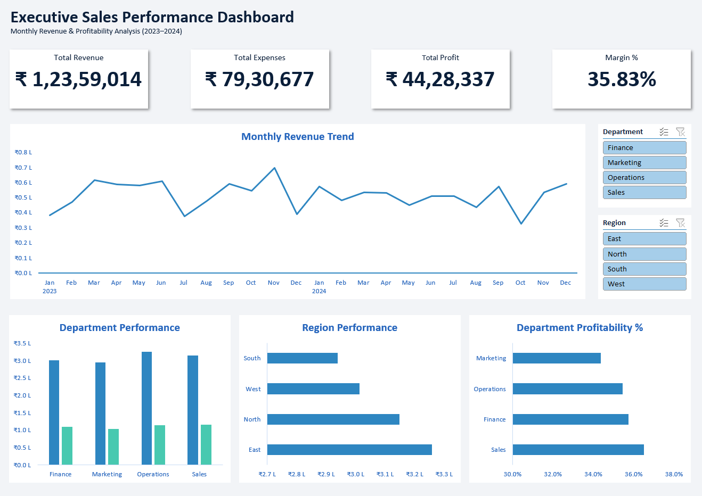

# 📊 Executive Sales Performance Dashboard (Excel)

---

## 📌 Project Overview

This project presents an interactive **Executive Sales Performance Dashboard** built using Microsoft Excel to analyze revenue, expenses, profitability, and margin performance across departments and regions for the years 2023–2024.

The dashboard is designed to provide business leaders with a clear, high-level view of financial performance, operational efficiency, and growth trends.

---

## 🎯 Business Problem

Organizations need a centralized dashboard to:

- Track total revenue, expenses, and overall profitability
- Monitor monthly revenue trends
- Compare department-level performance
- Analyze regional revenue contribution
- Evaluate profit margin efficiency by department
- Enable quick filtering using interactive controls

This dashboard addresses those needs through dynamic visualization and KPI tracking.

---

## 🛠 Tools & Techniques Used

- **Microsoft Excel**
- Pivot Tables
- Pivot Charts
- Slicers (Department & Region)
- Calculated Columns (Profit, Margin %)
- Custom Axis Formatting (₹ Lakhs format)
- KPI Card Design
- Data Modeling & Aggregation

---

## 📈 Key Performance Indicators (KPIs)

- **Total Revenue:** ₹ 1,23,59,014  
- **Total Expenses:** ₹ 79,30,677  
- **Total Profit:** ₹ 44,28,337  
- **Overall Profit Margin:** 35.83%

---

## 📊 Dashboard Features

### 🔹 1. Monthly Revenue Trend
- Visualizes revenue performance over 24 months (2023–2024)
- Helps identify seasonality and revenue volatility

### 🔹 2. Department Performance
- Compares Revenue vs Profit across:
  - Finance
  - Marketing
  - Operations
  - Sales

### 🔹 3. Region Performance
- Revenue comparison across:
  - East
  - North
  - South
  - West

### 🔹 4. Department Profitability %
- Highlights efficiency differences across departments
- Helps identify high-margin business units

### 🔹 5. Interactive Filtering
- Dynamic slicers allow filtering by:
  - Department
  - Region

---

## 💡 Key Insights

- Operations department generated the highest revenue.
- East region contributed the largest share of total revenue.
- Sales department achieved the strongest profit margin.
- The business maintained an overall healthy margin of 35.83%.
- Revenue shows moderate monthly volatility with strong recovery periods.

---

## 🎨 Design Decisions

- Clean executive-style layout
- Consistent corporate color theme
- Lakhs (₹ L) formatting for readability
- Balanced KPI hierarchy
- Minimal visual clutter

The dashboard was designed with executive decision-making in mind.

---

## 📂 Repository Contents

- `Executive_Sales_Dashboard.xlsx` — Full interactive Excel dashboard
- `dashboard_screenshot.png` — Dashboard preview image
- `README.md` — Project documentation

---

## 🚀 Skills Demonstrated

- Business Intelligence Reporting
- Financial KPI Design
- Data Aggregation & Modeling
- Dashboard UX Design
- Analytical Storytelling
- Excel-Based Data Visualization

---

## 📬 Author

**Amit Kumar**  
Aspiring Data Analyst | Excel • SQL • Power BI  
Focused on building business-driven analytical dashboards.

---
